# CoNote Student Portal — Sitemap, User Flows and User Journeys

**Status:** Draft v0.1
**Related:** [`REQUIREMENTS.md`](./REQUIREMENTS.md) (routes in section 7, requirement IDs such as FR-NTE-5), [`MILESTONES.md`](./MILESTONES.md)

This document has three parts:

1. **Sitemap.** Every page and how pages connect.
2. **User flows.** Step-by-step paths for single tasks, including decisions and error branches.
3. **User journeys.** Longer stories across several sessions, showing what the student needs at each stage and which part of the design answers it.

Diagrams use Mermaid, which GitHub renders directly.

---

## Part 1 — Sitemap

### 1.1 Page tree

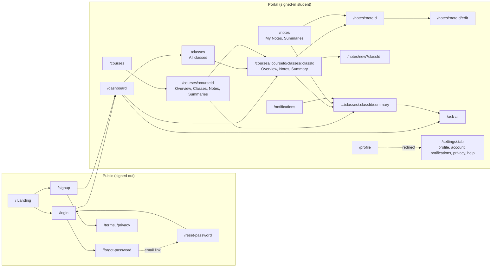

Every portal page also reaches the six primary nav items and the top-bar controls (section 1.3). Those links are left out of the diagram to keep it readable.

### 1.2 Page inventory

| Page | Route | In nav? | Main ways in | Main ways out |
|---|---|---|---|---|
| Landing | `/` | — | Direct visit, shared link | Sign in, Sign up |
| Sign in | `/login` | — | Landing, a portal URL while signed out | Dashboard or the `redirect` target, Forgot password, Sign up |
| Sign up | `/signup` | — | Landing, Sign in | Dashboard, Terms, Privacy |
| Forgot password | `/forgot-password` | — | Sign in | Back to Sign in |
| Reset password | `/reset-password` | — | Email link | Sign in |
| Terms / Privacy | `/terms`, `/privacy` | — | Sign up checkbox, footer | Back |
| Dashboard | `/dashboard` | Yes | After sign-in, nav | Class, All classes, Ask AI, any stat card's list |
| All classes | `/classes` | No | Dashboard "View all" | Class |
| My Courses | `/courses` | Yes | Nav, Dashboard stat card | Course Details |
| Course Details | `/courses/:courseId` | No | My Courses, search | Class, Summary, Note |
| Class | `/courses/:courseId/classes/:classId` | No | Course, Dashboard, All classes, search | New note, Note, Summary, Previous/Next class |
| Summary | `.../summary` | No | Class, Course Summaries tab, Notes Summaries tab, notification | Ask AI, Class |
| Notes | `/notes` | Yes | Nav, Dashboard stat card | Note, Edit, Summary |
| New note | `/notes/new` | No | Class "Add Note", Notes page | Class (Notes tab) |
| Note | `/notes/:noteId` | No | Notes, Class, Course, search | Edit, Class |
| Edit note | `/notes/:noteId/edit` | No | Note, Notes row icon | Note or Class |
| Ask CoNote AI | `/ask-ai` | Yes | Nav, Dashboard card, Summary panel | — |
| Notifications | `/notifications` | Yes | Nav, bell | Whatever the notification links to |
| Settings | `/settings/:tab` | Yes (desktop, tablet); avatar menu on phone | Nav, avatar menu, `/profile` | — |
| Not found | `*` | — | Bad or old link | Dashboard |

### 1.3 Navigation model

**Primary nav** (sidebar on desktop, icon rail on tablet, bottom bar on phone):

- Dashboard
- Courses
- Notes
- Ask AI
- Notifications
- Settings (on phones this sits in the avatar menu, since the bottom bar holds five items)

**Top bar:**

- global search (courses, classes, notes)
- notification bell
- avatar menu: Profile, Settings, Sign out

**Depth:** no page is more than three clicks from the Dashboard.

| To reach | Path | Clicks |
|---|---|---|
| A published summary | Courses → Course → Summaries tab → Summary | 3 |
| Today's class | Dashboard → Upcoming Classes row | 1 |
| Write a note for today's class | Dashboard → class row → Add Note | 2 |

**Back links:**

- Course Details, Class, Summary and Note pages each have a back link to their parent.
- The browser Back button also works, because tabs are stored in the URL (`?tab=`).

---

## Part 2 — User flows

Each flow names the requirement IDs it depends on. In mock mode, OAuth buttons skip the provider screen and sign in straight away (FR-AUTH-7).

### F1 — Sign up

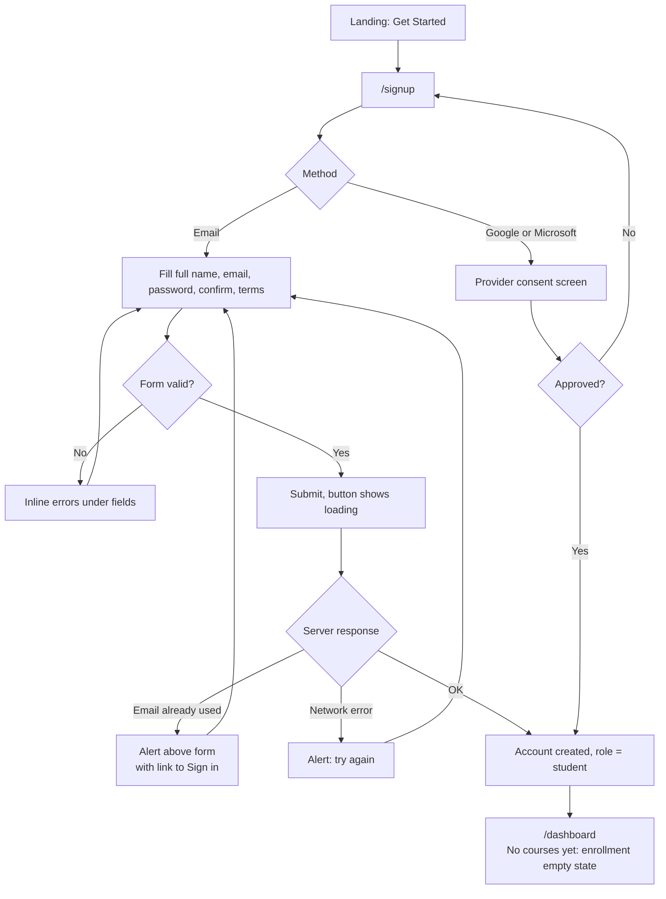

**Requirements:** FR-AUTH-2, FR-AUTH-3, FR-AUTH-6, FR-DSH-6.

**Note:** a brand-new student has no courses until a teacher or admin enrolls them (decision D9). Their first dashboard is the empty state.

### F2 — Sign in and return to the requested page

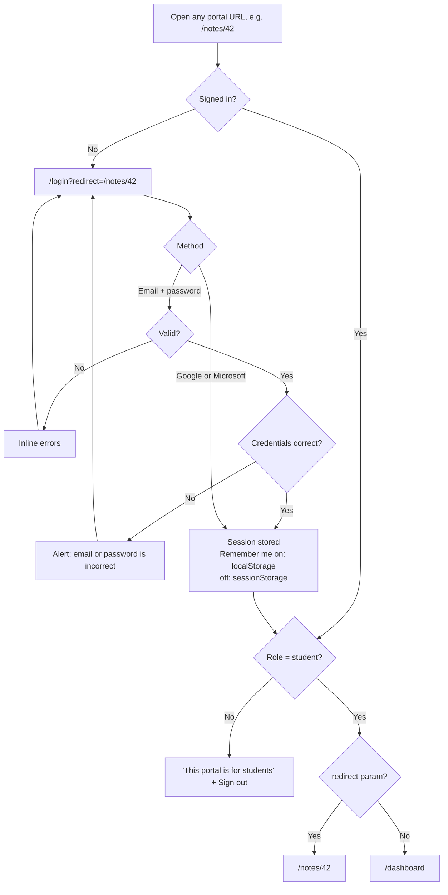

**Requirements:** FR-AUTH-1, FR-AUTH-8, section 3 (role check), section 7.2 (redirect).

**Note:** the error message never says which of the two fields was wrong.

### F3 — Forgot and reset password

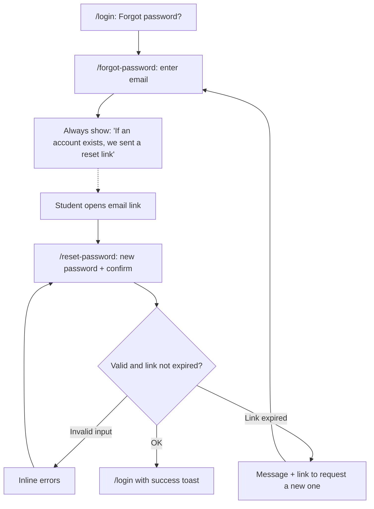

**Requirements:** FR-AUTH-4, FR-AUTH-5.

**Mock mode:** no email is sent. The forgot-password confirmation screen shows a "Continue to reset (demo)" link instead.

### F4 — Write a note for a class

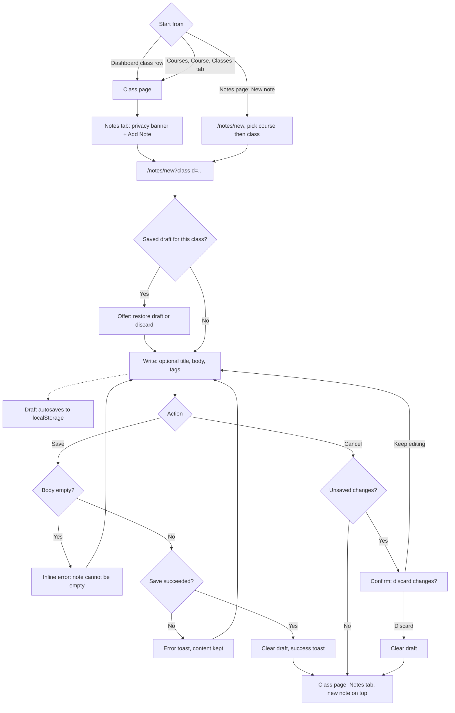

**Requirements:** FR-CLS-3, FR-CLS-4, FR-NTE-1 to FR-NTE-6.

### F5 — Edit or delete a note

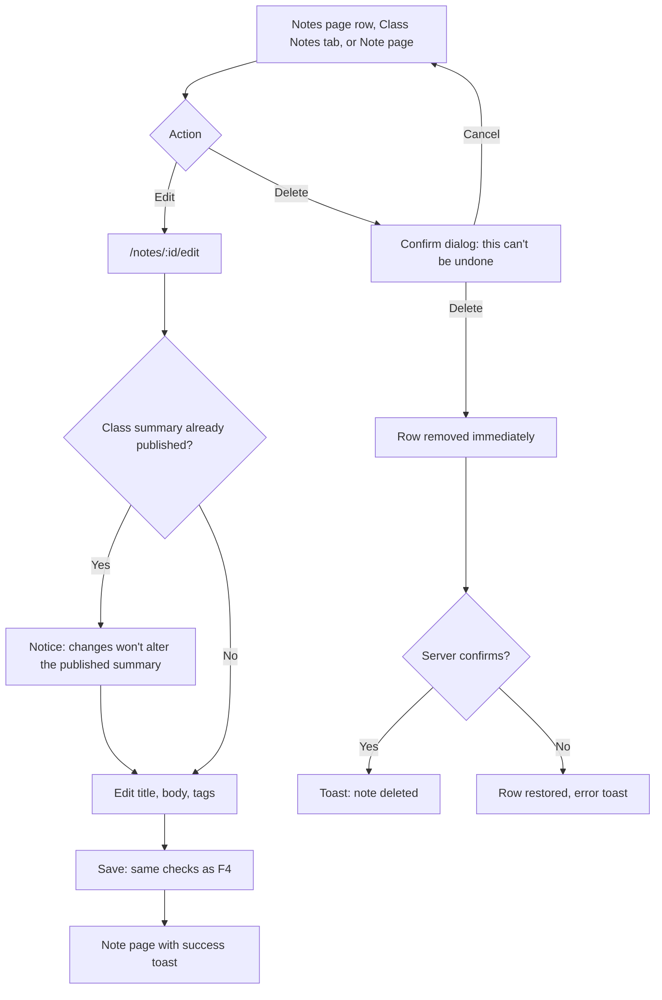

**Requirements:** FR-NTE-7 to FR-NTE-9, section 11 (optimistic updates).

### F6 — Open a class summary

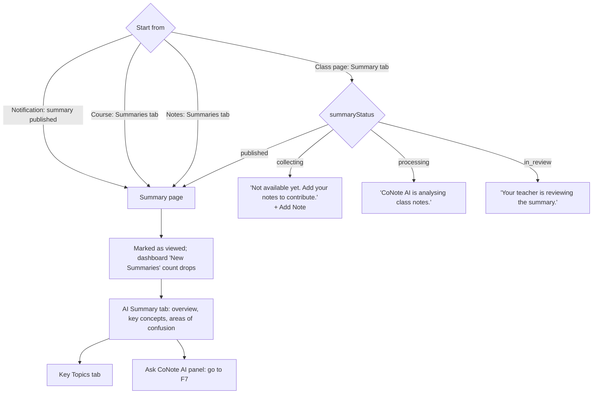

**Requirements:** section 4, FR-CLS-2, FR-SUM-1 to FR-SUM-6.

**Rule:** a direct link to the summary URL for an unpublished class shows the status card, never draft content.

### F7 — Ask CoNote AI

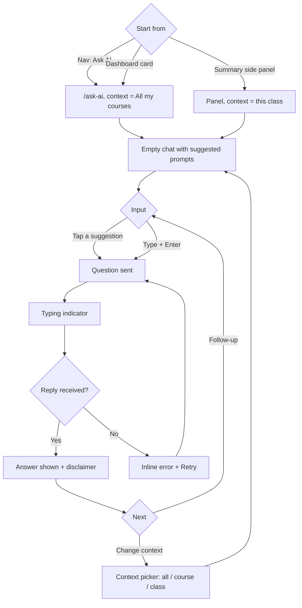

**Requirements:** FR-AI-1 to FR-AI-6, FR-SUM-4.

**Notes:**
- In v1 replies are canned (FR-AI-6).
- The conversation is lost when the page is left (FR-AI-8).
- Changing context starts a new conversation, after a confirm if messages exist (FR-AI-2).

### F8 — Act on a notification

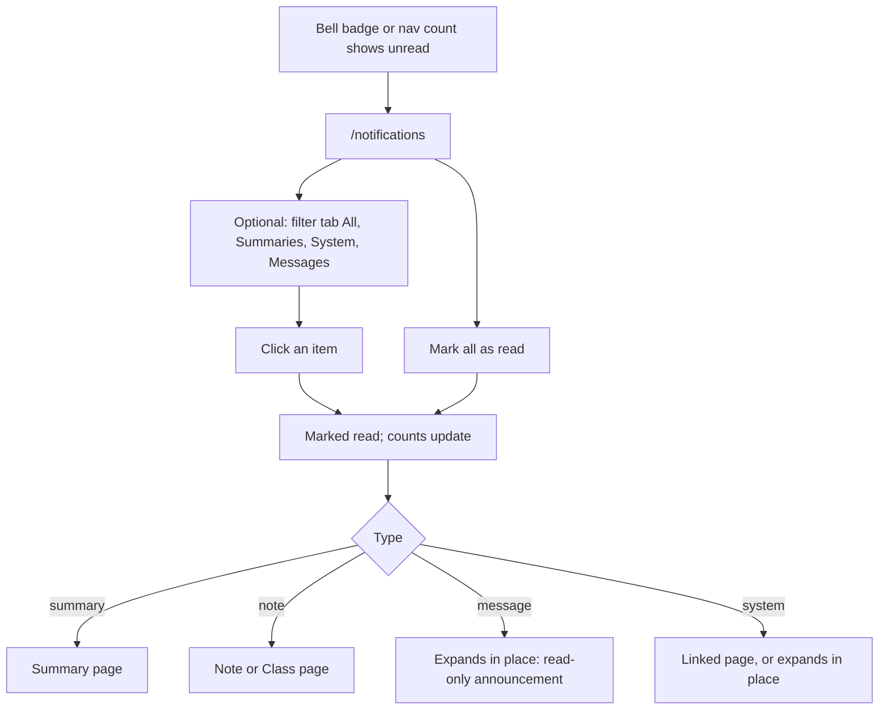

**Requirements:** FR-NTF-1 to FR-NTF-5.

**Note:** messages are one-way. There is no reply box (decision D11).

### F9 — Update profile and settings

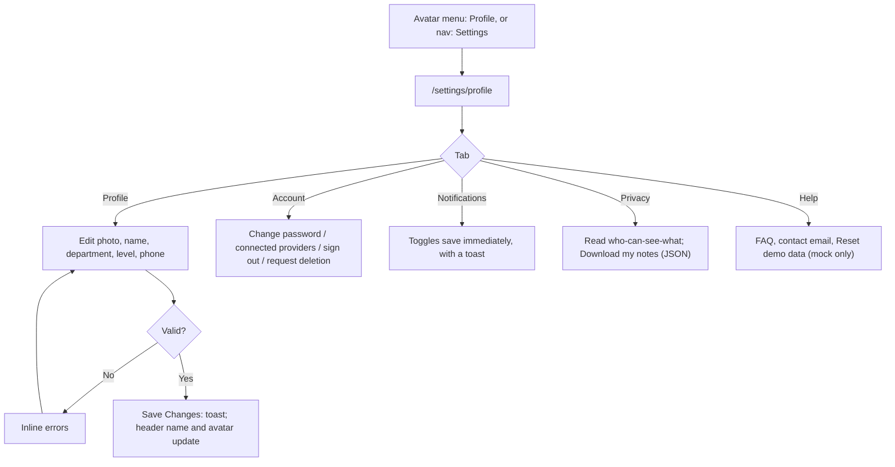

**Requirements:** FR-SET-1 to FR-SET-5.

### F10 — Sign out

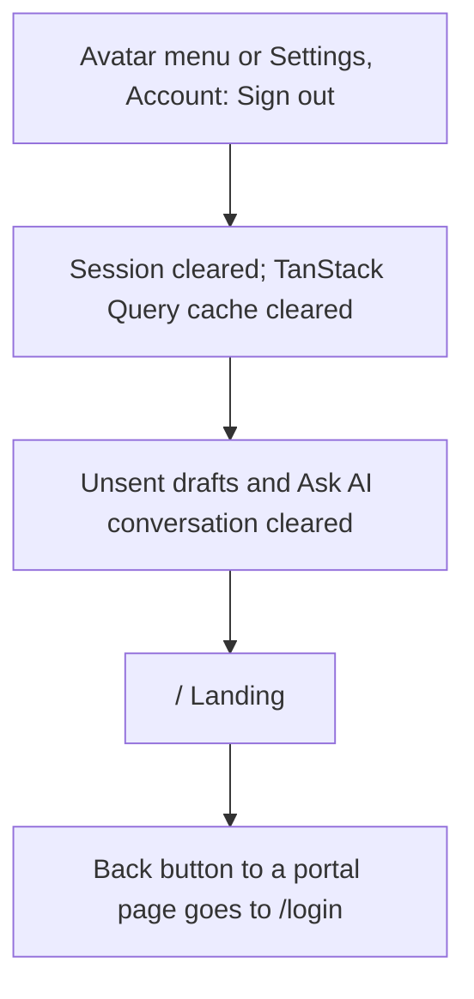

**Note:** sign-out also clears unsent drafts and the Ask AI conversation, so the next person on a shared computer sees nothing of the previous student's (NFR-4).

### F11 — Install the app

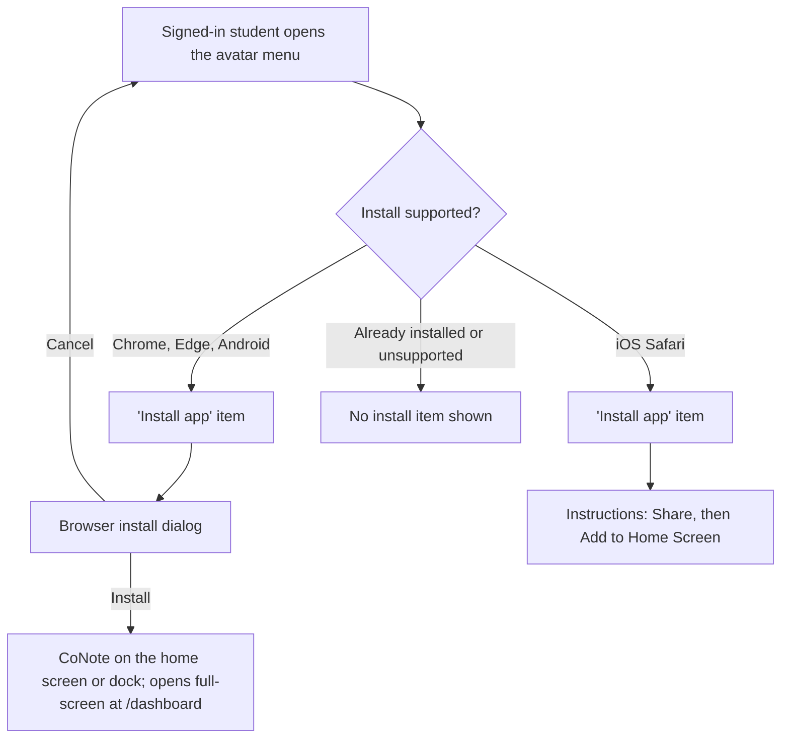

**Requirements:** FR-PWA-1, FR-PWA-6.

### F12 — Offline and updates

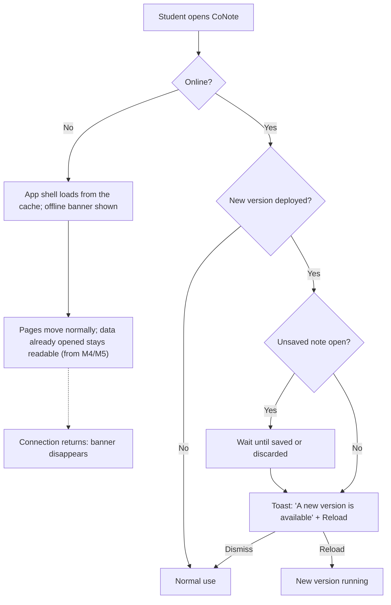

**Requirements:** FR-PWA-3 to FR-PWA-5.

**Note:** an update never replaces the running version silently, and never while a note has unsaved changes.

---

## Part 3 — User journeys

### Persona

**Victory, second-year Computer Science student.**

- Four courses this semester, including SWE 311 Software Engineering with Dr. Smith.
- Takes notes on a laptop in lectures. Checks things on a phone between classes.
- Sometimes leaves a lecture unsure about one concept, and does not always ask in class.

Each journey below is a table:

| Column | Meaning |
|---|---|
| Stage | Where Victory is in the journey |
| Does | What Victory does |
| Screen | Where it happens |
| Needs | What has to be true for that step to work |
| Risk | What could go wrong |
| Design response | The requirement that answers the risk |

### J1 — First visit to first note

**Goal:** go from hearing about CoNote to having one saved note.

| Stage | Does | Screen | Needs | Risk | Design response |
|---|---|---|---|---|---|
| Discover | Opens a link from a classmate | Landing | To understand what CoNote is in under a minute | Thinks it's a shared-notes site and worries about privacy | Hero line, six steps including "Teacher Reviews", About section on privacy (FR-LND-2, 3, 5) |
| Sign up | Picks Google | Sign up | A fast start | Abandons a long form | Google and Microsoft buttons above the fold (FR-AUTH-2) |
| Land | Sees the dashboard | Dashboard | To see their courses | Not yet enrolled: an empty page with no explanation | Empty state explains that a teacher or admin adds courses (FR-DSH-6) |
| Orient | Opens SWE 311 | Courses → Course Details | To find today's lesson | Unclear difference between course and class | Classes tab lists numbered, dated lessons (FR-CRS-4) |
| Write | Opens class 2 and taps Add Note | Class → New note | To feel safe writing freely | Fears classmates will read it | Privacy banner on the Notes tab and in the editor (FR-CLS-3) |
| Save | Adds "Question" and "Key concept" tags, then saves | New note | Confirmation it worked | Lost work on a slow connection | Draft autosave, success toast, return to the class (FR-NTE-5, 6) |

### J2 — A class day

**Goal:** get notes down during a lecture with little effort.

| Stage | Does | Screen | Needs | Risk | Design response |
|---|---|---|---|---|---|
| Before class | Checks the phone at breakfast | Dashboard (phone) | What's on today | Hunting through courses | "Classes Today" stat and Upcoming Classes list (FR-DSH-2, 3) |
| Class starts | Opens the laptop | Dashboard → class row | One click to the right lesson | Picks the wrong lesson | "Live" badge on the current session (FR-DSH-3) |
| During class | Types quickly, bolds key terms, tags a question | New note | An editor that stays out of the way | Browser tab closed by accident | Draft autosave and restore prompt (FR-NTE-5, flow F4) |
| After class | Tidies wording and adds an example | Edit note | To change notes later | Unsure whether edits reach the summary | Notice on edit when a summary is already published (FR-NTE-9) |
| Next lecture | Goes from class 2 to class 3 | Class page | Quick movement between lessons | Back to the course list every time | Previous/Next links (FR-CLS-5) |

### J3 — The summary arrives

**Goal:** clear up the concept Victory found confusing.

| Stage | Does | Screen | Needs | Risk | Design response |
|---|---|---|---|---|---|
| Waiting | Checks the class two days later | Class, Summary tab | To know when to come back | Thinks the feature is broken | Status card: "Your teacher is reviewing the summary" (section 4) |
| Alert | Gets "New summary available" | Notifications (phone) | To go straight to it | Several taps to find it | Notification links directly to the summary (flow F8) |
| Read | Reads Key Concepts | Summary | To trust what is written | Doubts AI output | "Reviewed by Dr. Smith" and "Based on 24 student notes" in the header (FR-SUM-1, 3) |
| Recognise | Finds the confusion listed under Common Areas of Confusion | Summary | To feel less alone in not getting it | — | The confusion section, each with a clarification (FR-SUM-2) |
| Dig in | Asks "Give me an example" in the side panel | Summary → AI panel | An answer tied to this class | Answer drifts off topic | Panel context is locked to this class (FR-AI-2, 3) |
| Close the loop | Adds a new note with the example | New note | To keep what was learned | Forgets later | Add Note is one click from the class (flow F4) |

### J4 — Exam revision

**Goal:** revise a whole course in one sitting.

| Stage | Does | Screen | Needs | Risk | Design response |
|---|---|---|---|---|---|
| Gather | Filters Notes by SWE 311 | Notes page | Everything for one course together | Notes scattered by class | Course filter and sort (FR-NTE-7) |
| Summaries | Opens the Summaries tab | Notes → Summaries | All approved summaries in order | Missing classes go unnoticed | Unpublished classes show their status on the Course Classes tab (FR-CRS-4) |
| Find | Searches "validation" | Global search | A specific topic fast | Search only covers titles | v1 matches titles (section 8, D18). Full-text search comes with the backend. |
| Test self | Asks AI with context "SWE 311" | Ask AI | Practice questions across the course | Context left on "All courses" | Context picker is visible above the chat (FR-AI-2) |
| Keep a copy | Downloads notes | Settings → Privacy | An offline copy before the exam | No export exists | JSON export (FR-SET-4) |

### J5 — On a phone between classes

**Goal:** quick checks on a small screen.

| Stage | Does | Screen | Needs | Risk | Design response |
|---|---|---|---|---|---|
| Open | Opens CoNote from the home screen | Dashboard (phone) | Fast load on mobile data, even with a weak signal | Slow first paint, or nothing at all offline | Installed app shell from the cache (FR-PWA-2); code-split routes and LCP target (NFR-3) |
| Move around | Uses the bottom bar | Any | Thumb-reachable nav | Tiny targets | Bottom bar, 44 px targets (section 8, NFR-1) |
| Read | Reads a summary | Summary (phone) | Readable text, no sideways scrolling | Side panel squeezes the text | AI panel becomes a floating button and bottom sheet (FR-SUM-4) |
| Settings | Changes notification preferences | Avatar menu → Settings | To find Settings without a nav item | Can't find it | Settings in the avatar menu on phones (section 8) |

---

## Gaps these flows exposed

These came up while mapping the flows. All six are now in `REQUIREMENTS.md` (Draft v0.2):

| # | Gap | Found in | Now covered by |
|---|---|---|---|
| 1 | Expired or used reset link | F3 | FR-AUTH-5 |
| 2 | How a saved draft comes back | F4 | FR-NTE-5, decision D19 |
| 3 | No email in mock mode, so no way to reach the reset page | F3 | FR-AUTH-7 |
| 4 | Changing Ask AI context mid-conversation | F7 | FR-AI-2, decision D17 |
| 5 | Leftover data after sign-out on a shared computer | F10 | NFR-4 |
| 6 | Search does not look inside note text | J4 | Section 8, decision D18, backend stage in `MILESTONES.md` |
